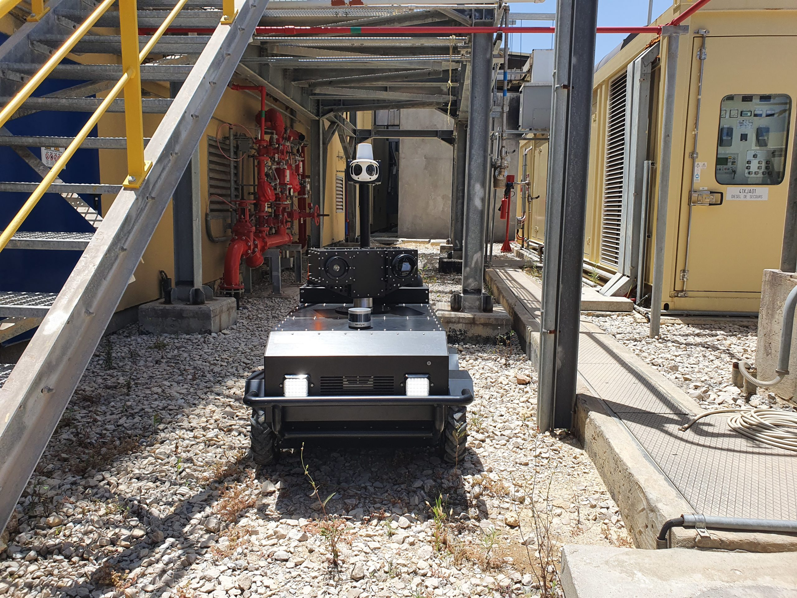
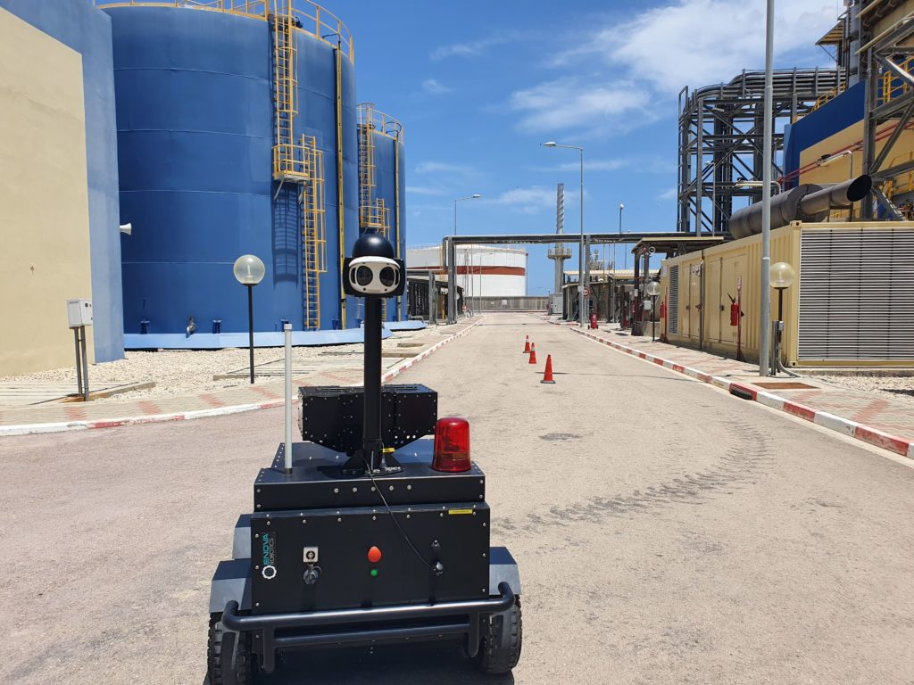
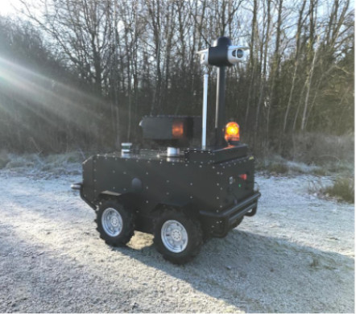
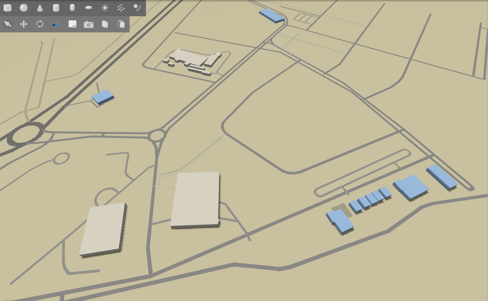
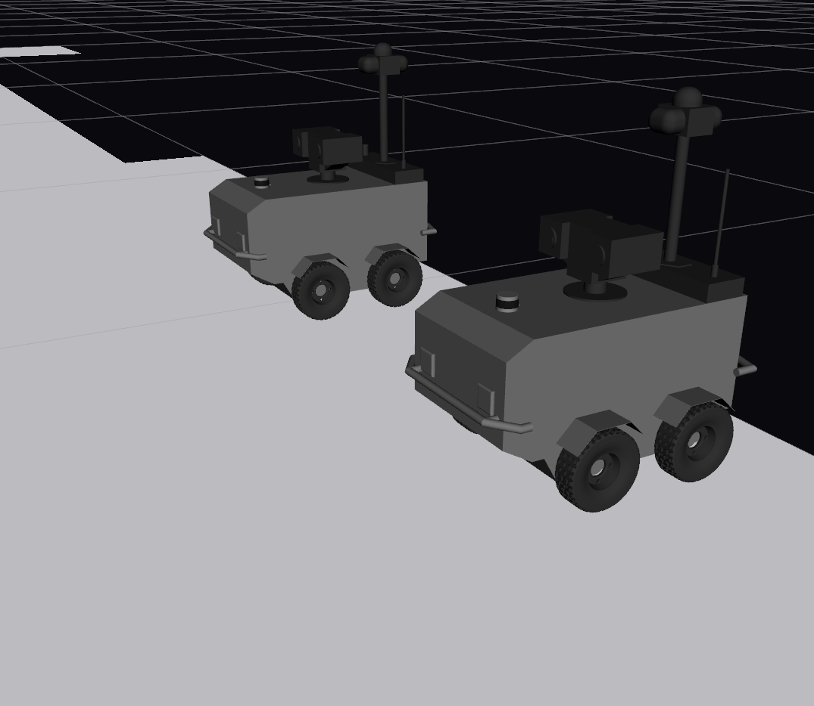
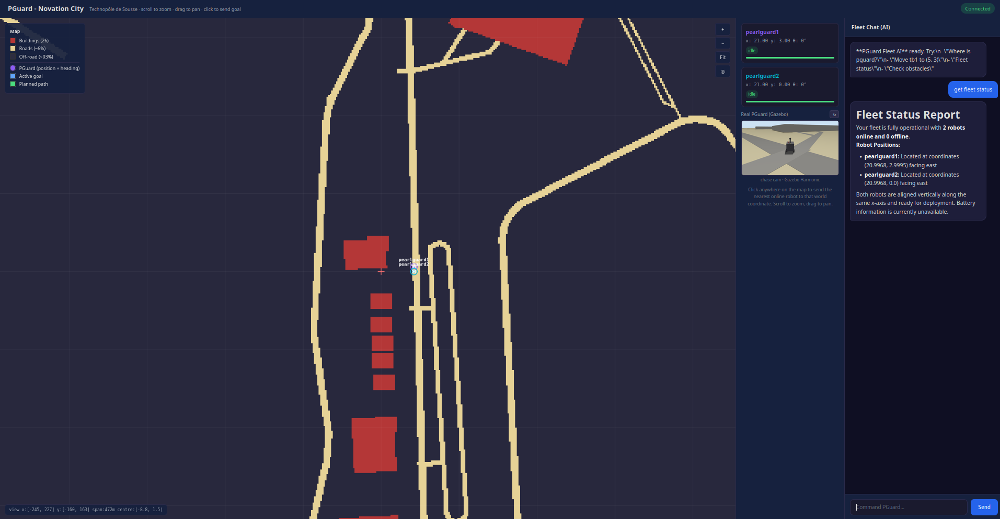

# 🤖 robo_fleet — AI-Driven ROS 2 Multi-Robot Fleet

**robo_fleet** is a complete multi-robot security fleet platform built around **ROS 2, Gazebo, Nav2, and an AI multi-agent system**.

The project simulates the **Enova site at Technopole de Sousse / Novation City** using real geographic data from **OpenStreetMap**, where multiple **PearlGuard** security robots navigate autonomously and can be supervised through an **AI-powered fleet management layer**.

The system combines:

* 🌍 A realistic simulation of the Enova site generated from OpenStreetMap data
* 🤖 Multiple PearlGuard security robots
* 🧭 Autonomous navigation using **Nav2**
* 📡 Multi-sensor localization using **RTK GPS, IMU, LiDAR, and wheel odometry**
* 🗺️ Multi-robot navigation in a shared environment
* 🧠 An **AI multi-agent system** for fleet supervision and coordination
* 🔌 **Model Context Protocol (MCP)** for AI-to-robot interaction
* 💬 An integrated **AI chatbot** for natural-language fleet control
* 📊 A live dashboard for monitoring and controlling the fleet

---

## 📸 The PearlGuard Robot

The simulated robot is based on the **PearlGuard / PGuard outdoor security robot developed by Enova Robotics**.

### Real Robot

<p align="center">
  
  
  
</p>

The simulation uses the real PearlGuard CAD meshes and reproduces its main sensing and navigation capabilities.

---

# 🏗️ System Overview

The project is divided into two tightly connected layers:

```text
                    ┌──────────────────────────────┐
                    │       AI Multi-Agent Layer   │
                    │                              │
                    │ Supervisor + Specialist     │
                    │ Agents + MCP + Chatbot      │
                    └──────────────┬───────────────┘
                                   │
                                   ▼
                    ┌──────────────────────────────┐
                    │       Fleet Management       │
                    │                              │
                    │ Navigation • Monitoring      │
                    │ Planning • Collision • Queue│
                    └──────────────┬───────────────┘
                                   │
                                   ▼
                    ┌──────────────────────────────┐
                    │           ROS 2              │
                    │                              │
                    │ Gazebo • EKF • Nav2 • TF2   │
                    └──────────────┬───────────────┘
                                   │
                    ┌──────────────┴──────────────┐
                    ▼                             ▼
             ┌─────────────┐               ┌─────────────┐
             │ PearlGuard 1│               │ PearlGuard 2│
             │             │               │             │
             │ LiDAR       │               │ LiDAR       │
             │ RTK GPS     │               │ RTK GPS     │
             │ IMU         │               │ IMU         │
             │ Odometry    │               │ Odometry    │
             └─────────────┘               └─────────────┘
```

---

# 🌍 1. ROS 2 Simulation & Robot Platform

## 1.1 Simulating the Enova Site from OpenStreetMap

Instead of creating an artificial environment manually, the project reconstructs the **Technopole de Sousse / Novation City** environment from real geographic data.

The environment is generated directly from **OpenStreetMap** using the Overpass API.

The origin of the local coordinate system is:

```text
Latitude:  35.8173
Longitude: 10.5912
```

The map-generation pipeline consists of three main scripts:

| File                                       | Description                                                                                                                                            |
| ------------------------------------------ | ------------------------------------------------------------------------------------------------------------------------------------------------------ |
| `src/my_pguard_bot/scripts/fetch_osm.py`   | Queries the Overpass API for buildings, roads, and named locations, projects the data into a local ENU frame, and generates the building and POI data. |
| `src/my_pguard_bot/scripts/build_world.py` | Combines the generated OSM buildings with the Gazebo world template.                                                                                   |
| `src/my_pguard_bot/scripts/build_map.py`   | Generates a Nav2 occupancy grid from the environment.                                                                                                  |

The generated environment uses a three-level representation:

* **Buildings → LETHAL**
* **Off-road / grass → NO_INFORMATION**
* **Roads → FREE**

The resulting map is approximately **1200 × 1200 m** with a resolution of **1 m/cell**.

### 🗺️ Generated Novation City Map

<p align="center">
  
</p>

The generated map is then used by **Nav2** for autonomous navigation.

More details:

* `docs/MAP_GENERATION.md`
* `docs/COSTMAP.md`

---

# 🤖 1.2 The PearlGuard Robot

The project initially used a simplified PGuard-like model before integrating the more realistic PearlGuard model.

### Custom PGuard-like Model

Located in:

```text
src/my_pguard_bot/description/
```

The model contains:

* Simplified chassis
* Turret
* Beacon
* Four driven wheels
* RTK GNSS
* IMU
* Four ultrasonic rangefinders
* Forward-facing camera

### Realistic PearlGuard Model

The final simulation uses the more realistic **PearlGuard model** located in:

```text
src/pearlguard_description/
```

It uses actual PGuard CAD meshes and includes:

* **VLP-16 3D LiDAR**
* **RTK GPS**
* **IMU**
* **Differential-drive odometry**

This model is used by the multi-robot simulation.

---

# 🤖🤖 1.3 Multi-Robot Simulation

The system currently runs **two independent PearlGuard robots**:

```text
pearlguard1
pearlguard2
```

The launch architecture is designed to be easily extended to additional robots by adding them to the robot configuration.

Each robot is fully namespaced to prevent topic and TF collisions.

For example:

```text
/pearlguard1/cmd_vel
/pearlguard1/scan
/pearlguard1/odometry
/pearlguard1/navigate_to_pose

/pearlguard2/cmd_vel
/pearlguard2/scan
/pearlguard2/odometry
/pearlguard2/navigate_to_pose
```

### 📡 Sensors

Each PearlGuard has:

* **VLP-16 3D LiDAR** — obstacle detection and navigation
* **RTK GPS** — absolute positioning
* **IMU** — orientation and motion estimation
* **Wheel odometry** — local motion estimation

The sensor measurements are combined using a **dual-EKF localization architecture**.

---

## 🧭 1.4 Navigation with Nav2

Each robot runs its own namespaced **Nav2 stack**, including:

* Planner
* Controller
* Global costmap
* Local costmap
* Map server
* Behavior tree navigation
* TF transforms

The configuration is separated for each robot:

```text
config/nav2_params_pearlguard1.yaml
config/nav2_params_pearlguard2.yaml

config/ekf_pearlguard1.yaml
config/ekf_pearlguard2.yaml
```

### 🖥️ Two-Robot Navigation in RViz

<p align="center">
  
</p>

Both robots can navigate independently within the same simulated environment while maintaining separate localization and navigation stacks.

---

# 🧩 1.5 Launch Architecture

| Launch file                     | Description                                                                    |
| ------------------------------- | ------------------------------------------------------------------------------ |
| `launch/full_stack.launch.py`   | Main entry point: simulation + localization + Nav2 for both robots.            |
| `launch/sim.launch.py`          | Starts Gazebo, robot state publishers, robot spawning, and ROS-Gazebo bridges. |
| `launch/localization.launch.py` | Starts the dual-EKF localization system for each robot.                        |
| `launch/robofleet.launch.py`    | Starts the fleet topic adapter and rosbridge WebSocket.                        |
| `launch/patrol.launch.py`       | Runs GPS-based perimeter patrol.                                               |
| `launch/viz.launch.py`          | Starts the Foxglove bridge for visualization.                                  |

---

# 🧠 2. AI Multi-Agent Fleet Layer & MCP

The second major component of the project is an **AI-driven fleet management system**.

The `mcp_server/` package exposes ROS 2 fleet operations as **Model Context Protocol (MCP) tools**, allowing an AI system to interact directly with the robot fleet.

The AI layer is not simply a monitoring interface — it is part of the core fleet-control architecture.

It allows users to interact with the fleet using **natural language**.

For example:

```text
"Where is PearlGuard 1?"

"Send PearlGuard 2 to the north entrance."

"Check the battery level of the fleet."

"Are there any obstacles near PearlGuard 1?"

"Assign the nearest robot to this location."

"Stop all robots."
```

---

# 🧠 2.1 Multi-Agent Architecture

The AI system uses a **supervisor + specialist agent architecture**.

```text
                    User
                     │
                     ▼
              ┌──────────────┐
              │   Chatbot    │
              └──────┬───────┘
                     │
                     ▼
             ┌───────────────┐
             │   Supervisor  │
             │      Agent    │
             └───────┬───────┘
                     │
       ┌─────────────┼─────────────┐
       ▼             ▼             ▼
 Navigation      Monitoring     Planning
   Agent           Agent          Agent
       │             │             │
       └─────────────┼─────────────┘
                     ▼
                  MCP Tools
                     │
                     ▼
                   ROS 2
                     │
             ┌───────┴───────┐
             ▼               ▼
        PearlGuard 1     PearlGuard 2
```

The supervisor determines which specialist agent should handle a request.

Each specialist agent has its own tools and system prompt.

---

# 🤖 2.2 The Agents

| Agent                       | Role                                               | Main Tools                                                       |
| --------------------------- | -------------------------------------------------- | ---------------------------------------------------------------- |
| **Navigation Agent**        | Moves robots to coordinates and waypoints          | `navigate_to_pose`, `navigate_waypoints`                         |
| **Monitoring Agent**        | Monitors robot and fleet state                     | `get_robot_position`, `get_fleet_status`, `get_battery_level`    |
| **Control Agent**           | Performs emergency and direct control operations   | `stop_robot`, `emergency_stop`                                   |
| **Collision Agent**         | Detects and predicts possible collisions           | `check_obstacles`, `predict_collisions`                          |
| **Planning Agent**          | Assigns and optimizes tasks                        | `assign_tasks`, `dispatch_tasks`, `replan`                       |
| **Queue Agent**             | Manages the task queue                             | `add_task_to_queue`, `start_auto_dispatch`, `stop_auto_dispatch` |
| **Dashboard Agent**         | Controls dashboard services                        | `start_dashboard`, `stop_dashboard`                              |
| **Natural Language Agent**  | Handles named locations and nearest-robot requests | `list_locations`, `go_to_location`, `send_nearest_to`            |
| **Map Visualization Agent** | Provides fleet position visualization              | `get_map_with_robots`                                            |

---

# 💬 2.3 AI Chatbot & Fleet Dashboard

The project includes a live web dashboard that provides:

* Real-time robot positions
* Fleet status
* Battery information
* Robot control
* Navigation commands
* Task management
* Map visualization
* **AI chatbot for natural-language fleet control**

### 📊 Fleet Dashboard

<p align="center">
  
</p>

The chatbot provides a natural-language interface to the fleet.

Instead of manually calling ROS 2 commands, users can interact with the robots conversationally.

For example:

```text
User:
"Send the nearest robot to the Enova building."

        ↓

AI Supervisor

        ↓

Planning / Navigation Agent

        ↓

MCP Tool

        ↓

ROS 2 / Nav2

        ↓

PearlGuard
```

The dashboard therefore acts as both a **fleet monitoring interface and an AI command center**.

---

# 🔌 2.4 Model Context Protocol

The MCP server transforms ROS 2 fleet operations into AI-callable tools.

Main components:

```text
mcp_server/
├── server.py
├── index.py
├── agents/
├── graph/
├── tools/
├── ros/
└── coordination/
```

### ROS Interface

`ros/ros_client.py` provides the low-level communication layer through **rosbridge WebSocket**.

### Fleet State

`coordination/fleet_state.py` maintains a persistent connection to rosbridge and caches live information about the fleet.

### Coordination

The coordination layer contains:

```text
task_planner.py
task_queue.py
hungarian.py
collision_predictor.py
dashboard_server.py
chat_agent.py
```

This allows the system to perform:

* Task allocation
* Battery-aware assignment
* Optimal robot assignment
* Collision prediction
* Automatic task dispatch
* Fleet monitoring
* AI-based interaction

---

# 🛠️ 3. Quick Start

The complete ROS 2 stack runs **directly on the host system**.

### Prerequisites

* Ubuntu 24.04
* ROS 2 Jazzy
* Gazebo Harmonic
* Nav2
* Python 3
* rosbridge
* Foxglove Bridge *(optional for visualization)*

---

## 3.1 Build the Workspace

Source ROS 2 Jazzy:

```bash
source /opt/ros/jazzy/setup.bash
```

Install dependencies:

```bash
rosdep update

rosdep install --from-paths src --ignore-src -r -y
```

Build:

```bash
colcon build
```

Source the workspace:

```bash
source install/setup.bash
```

---

# 🚀 3.2 Launch the Simulation

Start the complete simulation:

```bash
ros2 launch my_pguard_bot full_stack.launch.py
```

This starts:

* Gazebo
* Novation City environment
* PearlGuard 1
* PearlGuard 2
* Robot state publishers
* Dual-EKF localization
* Nav2 for both robots
* Map server
* Required TF transforms

---

# 🔌 3.3 Launch the Fleet Communication Layer

In a second terminal:

```bash
source /opt/ros/jazzy/setup.bash
source install/setup.bash

ros2 launch my_pguard_bot robofleet.launch.py
```

This starts:

* `rosbridge_server`
* WebSocket communication on port `9090`
* `robo_fleet_adapter`

The adapter exposes the namespaced ROS 2 topics through the interface expected by the fleet and MCP layers.

---

# 📊 3.4 Launch the Dashboard

Start the dashboard:

```bash
python3 start_dashboard.py \
  --rosbridge localhost \
  --robots pearlguard1 pearlguard2 \
  --open
```

The dashboard provides the main interface for:

* Monitoring both robots
* Sending navigation commands
* Managing tasks
* Viewing fleet status
* Interacting with the AI chatbot

---

# 🤖 3.5 Use the AI Fleet Controller

The AI chatbot is an integral part of the system.

Once the dashboard is running, commands can be given using natural language.

Examples:

```text
Where is pearlguard1?

Send pearlguard2 to coordinates 25, -112.

What is the current fleet status?

Check obstacles near pearlguard1.

Send the nearest robot to the Enova building.

Stop pearlguard1.
```

The chatbot interprets the request and uses the appropriate AI agent and MCP tools to interact with the ROS 2 fleet.

---

# 📁 4. Repository Structure

```text
robo_fleet/
│
├── mcp_server/
│   ├── server.py
│   ├── index.py
│   ├── agents/
│   ├── graph/
│   ├── tools/
│   ├── ros/
│   └── coordination/
│
├── src/
│   ├── my_pguard_bot/
│   │   ├── worlds/
│   │   ├── maps/
│   │   ├── config/
│   │   ├── launch/
│   │   └── scripts/
│   │
│   └── pearlguard_description/
│       ├── meshes/
│       ├── urdf/
│       └── ...
│
├── dashboard/
│
├── docs/
│   ├── images/
│   │   ├── pearlguard_real_1.jpg
│   │   ├── pearlguard_real_2.jpg
│   │   ├── pearlguard_real_3.jpg
│   │   ├── novation_city_map.png
│   │   ├── two_pearlguard_rviz.png
│   │   └── fleet_dashboard.png
│   │
│   ├── MAP_GENERATION.md
│   ├── COSTMAP.md
│   ├── PROJECT.md
│   └── outdoor-sim-guide.md
│
├── start_dashboard.py
├── run.py
├── run_tests.py
├── SETUP.md
└── README.md
```

---

# 📚 Documentation

Additional documentation:

* `docs/MAP_GENERATION.md` — OpenStreetMap → Gazebo world → Nav2 map
* `docs/COSTMAP.md` — Nav2 costmap configuration
* `docs/PROJECT.md` — project architecture and implementation
* `docs/outdoor-sim-guide.md` — outdoor simulation guide
* `SETUP.md` — installation and setup instructions

---

# 🎯 Project Objective

The goal of **robo_fleet** is to build a complete autonomous security-robot fleet that combines **robotics, navigation, multi-agent AI, and natural-language interaction**.

The resulting pipeline connects:

```text
Real Environment
      │
      ▼
OpenStreetMap
      │
      ▼
Gazebo Simulation
      │
      ▼
ROS 2 + Nav2
      │
      ▼
Multi-Robot Fleet
      │
      ▼
MCP Interface
      │
      ▼
AI Multi-Agent System
      │
      ▼
Natural-Language Chatbot
      │
      ▼
Fleet Coordination & Control
```

The project demonstrates how **ROS 2 autonomous robots can be combined with modern AI agent architectures to create an intelligent multi-robot fleet management system.**

---

# 📜 License

MIT
