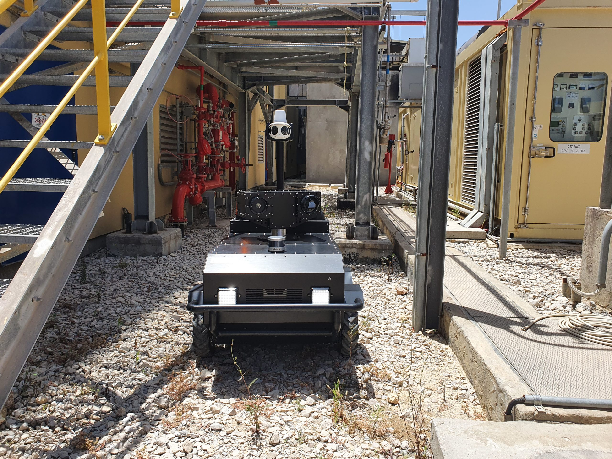
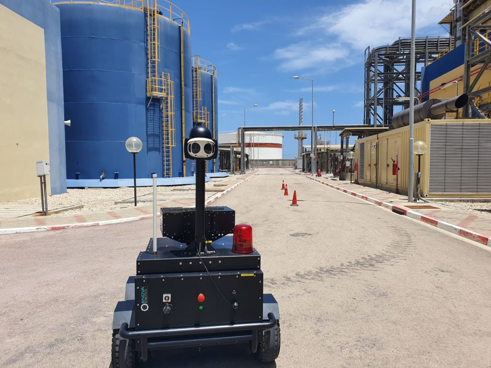
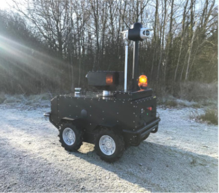
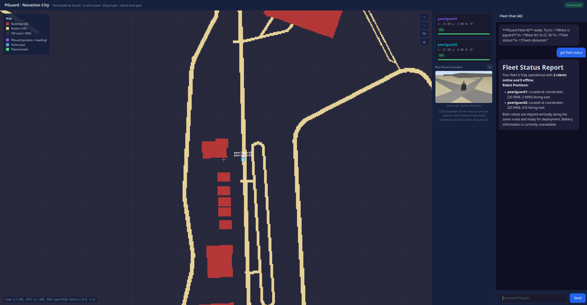

# 🤖 robo_fleet — AI-Driven ROS 2 Multi-Robot Fleet

**robo_fleet** is a complete multi-robot security fleet platform built around **ROS 2, Gazebo, Nav2, and an AI multi-agent system**.

The project simulates the **Enova site at Technopole de Sousse / Novation City** using real geographic data from **OpenStreetMap**, where multiple **PearlGuard** security robots navigate autonomously and can be supervised through an **AI-powered fleet management layer**.

The system combines:

* 🌍 A realistic simulation of the Enova site generated from OpenStreetMap data
* 🤖 **Four PearlGuard security robots**
* 🧭 Autonomous navigation using **Nav2**
* 📡 Multi-sensor localization using **RTK GPS, IMU, LiDAR, and wheel odometry**
* 🗺️ Multi-robot navigation in a shared environment
* 🧠 **Hybrid AI fleet control**, combining direct tool execution with multi-agent reasoning
* 🔌 **Model Context Protocol (MCP)** for AI-to-robot interaction
* 💬 An integrated **AI chatbot** for natural-language fleet control
* 📊 A live dashboard for monitoring and controlling the fleet

---
## 📸 The PearlGuard Robot

The simulated robot is based on the **PearlGuard / PGuard outdoor security robot developed by Enova Robotics**.

### Real Robot

<p align="center">
  
  
  
</p>

The simulation uses the real PearlGuard CAD meshes and reproduces its main sensing and navigation capabilities.

---

# 🏗️ System Overview

The project is divided into two tightly connected layers:

```text
                         ┌──────────────────────────────┐
                         │       AI Fleet Layer         │
                         │                              │
                         │   Natural Language Input     │
                         └──────────────┬───────────────┘
                                        │
                       ┌────────────────┴────────────────┐
                       │                                 │
                 Simple Command                    Complex Mission
                       │                                 │
                       ▼                                 ▼
              ┌─────────────────┐              ┌──────────────────┐
              │  Direct Tool    │              │ Multi-Agent      │
              │  Execution      │              │ Reasoning Layer  │
              │                 │              │                  │
              │ Exact MCP Tool  │              │ Supervisor       │
              │ Call            │              │ + Specialists    │
              └────────┬────────┘              └────────┬─────────┘
                       │                                │
                       └────────────────┬───────────────┘
                                        ▼
                         ┌──────────────────────────────┐
                         │       Fleet Management       │
                         │                              │
                         │ Navigation • Monitoring      │
                         │ Planning • Collision • Queue │
                         └──────────────┬───────────────┘
                                        │
                                        ▼
                         ┌──────────────────────────────┐
                         │            ROS 2             │
                         │                              │
                         │ Gazebo • EKF • Nav2 • TF2   │
                         └──────────────┬───────────────┘
                                        │
                 ┌──────────┬───────────┼───────────┐
                 ▼          ▼           ▼           ▼
          ┌──────────┐ ┌──────────┐ ┌──────────┐ ┌──────────┐
          │PearlGuard│ │PearlGuard│ │PearlGuard│ │PearlGuard│
          │    1     │ │    2     │ │    3     │ │    4     │
          │          │ │          │ │          │ │          │
          │ LiDAR    │ │ LiDAR    │ │ LiDAR    │ │ LiDAR    │
          │ RTK GPS  │ │ RTK GPS  │ │ RTK GPS  │ │ RTK GPS  │
          │ IMU      │ │ IMU      │ │ IMU      │ │ IMU      │
          │ Odometry │ │ Odometry │ │ Odometry │ │ Odometry │
          └──────────┘ └──────────┘ └──────────┘ └──────────┘
```

The AI layer uses a **hybrid execution strategy**. Simple and deterministic commands are executed directly through the appropriate MCP tool, avoiding unnecessary multi-agent reasoning. More complex missions are routed through the multi-agent architecture, where specialized agents collaborate to plan and execute the required fleet operations.

---

# 🤖🤖🤖🤖 1.3 Multi-Robot Simulation

The system currently runs **four independent PearlGuard robots**:

```text
pearlguard1
pearlguard2
pearlguard3
pearlguard4
```

The launch architecture is designed around a reusable robot configuration, allowing the fleet to be extended without maintaining separate navigation and localization configuration files for every robot.

Each robot is fully namespaced to prevent topic and TF collisions.

For example:

```text
/pearlguard1/cmd_vel
/pearlguard1/scan
/pearlguard1/odometry
/pearlguard1/navigate_to_pose

/pearlguard2/cmd_vel
/pearlguard2/scan
/pearlguard2/odometry
/pearlguard2/navigate_to_pose

/pearlguard3/cmd_vel
/pearlguard3/scan
/pearlguard3/odometry
/pearlguard3/navigate_to_pose

/pearlguard4/cmd_vel
/pearlguard4/scan
/pearlguard4/odometry
/pearlguard4/navigate_to_pose
```

### 📡 Sensors

Each PearlGuard has:

* **VLP-16 3D LiDAR** — obstacle detection and navigation
* **RTK GPS** — absolute positioning
* **IMU** — orientation and motion estimation
* **Wheel odometry** — local motion estimation

The sensor measurements are combined using a **dual-EKF localization architecture**.

---

# 🧭 1.4 Navigation with Nav2

Each robot runs its own namespaced **Nav2 stack**, including:

* Planner
* Controller
* Global costmap
* Local costmap
* Map server
* Behavior tree navigation
* TF transforms

The fleet uses a **shared configuration architecture** rather than maintaining a separate YAML file for every robot.

The Nav2 and EKF configurations are based on a common configuration:

```text
config/nav2_params_pearlguard.yaml
config/ekf_pearlguard.yaml
```

The configuration is written using robot-specific namespaces so that the same configuration structure can be reused for all four robots:

```text
/pearlguard1/...
/pearlguard2/...
/pearlguard3/...
/pearlguard4/...
```

This avoids duplicating essentially identical configuration files while keeping every robot's topics, frames, localization, and navigation components isolated.

### 🖥️ Four-Robot Navigation in RViz

<p align="center">
  
</p>

All four robots can navigate independently within the same simulated environment while maintaining separate localization and navigation stacks.

---

# 🧩 1.5 Launch Architecture

| Launch file                     | Description                                                                            |
| ------------------------------- | -------------------------------------------------------------------------------------- |
| `launch/full_stack.launch.py`   | Main entry point: simulation + localization + Nav2 for all four robots.                |
| `launch/sim.launch.py`          | Starts Gazebo, robot state publishers, robot spawning, and ROS-Gazebo bridges.         |
| `launch/localization.launch.py` | Starts the dual-EKF localization system for all robots using the shared configuration. |
| `launch/robofleet.launch.py`    | Starts the fleet topic adapter and rosbridge WebSocket.                                |
| `launch/patrol.launch.py`       | Runs GPS-based perimeter patrol.                                                       |
| `launch/viz.launch.py`          | Starts the Foxglove bridge for visualization.                                          |

---

# 🧠 2. AI Fleet Layer & MCP

The second major component of the project is an **AI-driven fleet management system**.

The `mcp_server/` package exposes ROS 2 fleet operations as **Model Context Protocol (MCP) tools**, allowing an AI system to interact directly with the robot fleet.

The AI architecture uses **two execution modes depending on the complexity of the user's request**.

### Simple Commands — Direct Tool Execution

For simple, deterministic commands where the required operation is clear, the system **directly calls the corresponding MCP tool** without invoking the multi-agent reasoning layer.

For example:

```text
User:
"Send PearlGuard 2 to coordinates 25, -112."

        ↓

Chatbot / Tool Selection

        ↓

navigate_to_pose(...)

        ↓

ROS 2 / Nav2

        ↓

PearlGuard 2
```

Other examples include:

```text
"Where is PearlGuard 1?"
→ get_robot_position

"Check the battery of PearlGuard 3."
→ get_battery_level

"Stop PearlGuard 4."
→ stop_robot

"Send PearlGuard 2 to the north entrance."
→ navigate_to_pose / go_to_location
```

This direct execution path reduces unnecessary reasoning and provides a faster and more predictable response for straightforward operations.

---

### Complex Missions — Multi-Agent Reasoning

When a request involves **planning, task allocation, multiple robots, constraints, optimization, or coordination**, the system activates the multi-agent layer.

For example:

```text
User:

"Secure the site by assigning the most suitable robots
to patrol the entrances while avoiding conflicts and
considering their current positions and battery levels."

        ↓

AI Supervisor

        ↓

┌───────────────┬───────────────┬────────────────┐
│ Planning      │ Monitoring    │ Collision      │
│ Agent         │ Agent         │ Agent          │
└───────┬───────┴───────┬───────┴───────┬────────┘
        │               │               │
        └───────────────┼───────────────┘
                        ▼
                   MCP Tools
                        │
                        ▼
                     ROS 2
                        │
                ┌───────┼───────┐
                ▼       ▼       ▼
              PG1     PG2     PG3     PG4
```

The multi-agent system allows the fleet to reason about the mission, divide it into subtasks, select appropriate robots, check constraints, and execute the resulting plan.

---

# 🧠 2.1 Multi-Agent Architecture

The AI system uses a **supervisor + specialist agent architecture** for complex missions.

```text
                         User
                          │
                          ▼
                   ┌─────────────┐
                   │   Chatbot   │
                   └──────┬──────┘
                          │
                  Complex Mission?
                     /          \
                   No            Yes
                   │              │
                   ▼              ▼
             Direct MCP      ┌──────────────┐
                Tool         │  Supervisor  │
                Call         │     Agent    │
                             └──────┬───────┘
                                    │
              ┌─────────────┬──────┼───────────┬─────────────┐
              ▼             ▼      ▼           ▼             ▼
         Navigation    Monitoring Planning  Collision     Queue
           Agent         Agent      Agent      Agent       Agent
              │             │        │           │           │
              └─────────────┴────────┼───────────┴───────────┘
                                     ▼
                                MCP Tools
                                     │
                                     ▼
                                   ROS 2
                                     │
                        ┌────────────┼────────────┐
                        ▼            ▼            ▼
                       PG1          PG2          PG3          PG4
```

The **supervisor is only used when the mission requires multi-step reasoning or coordination**.

Each specialist agent has its own role, system prompt, and tools.

This separation allows simple commands to remain lightweight while complex missions can benefit from specialized reasoning.

---

# 🤖 2.2 The Agents

The multi-agent layer currently contains specialized agents responsible for different aspects of fleet management:

| Agent                       | Role                                                     | Main Tools                                                                     |
| --------------------------- | -------------------------------------------------------- | ------------------------------------------------------------------------------ |
| **Navigation Agent**        | Plans and executes robot navigation, incl. named locations | `navigate_to_pose`, `navigate_waypoints`, `go_to_location`                   |
| **Monitoring Agent**        | Monitors robot and fleet state                           | `get_robot_position`, `get_fleet_status`, `get_battery_level`                  |
| **Collision Agent**         | Detects and predicts possible collisions                 | `check_obstacles`, `predict_collisions`                                        |
| **Planning Agent**          | Assigns and optimizes fleet tasks                        | `assign_tasks`, `dispatch_tasks`, `replan`, `set_robot_priority`               |
| **Dashboard Agent**         | Controls dashboard services                              | `start_dashboard`, `stop_dashboard`                                            |

> **Note:** Stop/emergency control (`stop_robot`, `emergency_stop`), task-queue management
> (`add_task_to_queue`, `get_queue`, `clear_queue`, `start_auto_dispatch`, `stop_auto_dispatch`),
> named-location CRUD and nearest-robot dispatch (`list_locations`, `add_location`,
> `remove_location`, `send_nearest_to`), and map visualization (`get_map_with_robots`) remain
> available as **MCP tools**, but are no longer wrapped as supervisor-routed specialist agents.

These agents are not necessarily invoked for every user request. They are used selectively when their specialization is required by the mission.

---

# 💬 2.3 AI Chatbot & Fleet Dashboard

The project includes a live web dashboard that provides:

* Real-time positions of all four robots
* Fleet status
* Battery information
* Robot control
* Navigation commands
* Task management
* Map visualization
* **AI chatbot for natural-language fleet control**

### 📊 Fleet Dashboard

<p align="center">
  
</p>

The chatbot provides a natural-language interface to the fleet.

Depending on the request, the chatbot can either directly execute a specific fleet operation or invoke the multi-agent reasoning layer for more complex missions.

### Simple command

```text
User:
"Send PearlGuard 3 to the Enova building."

        ↓

Direct MCP Tool Call

        ↓

navigate_to_pose / go_to_location

        ↓

ROS 2 / Nav2

        ↓

PearlGuard 3
```

### Complex mission

```text
User:
"Assign the best robots to patrol the four entrances,
consider their current positions and battery levels,
and avoid potential conflicts."

        ↓

AI Supervisor

        ↓

Planning Agent
        +
Monitoring Agent
        +
Collision Agent
        +
Navigation Agent

        ↓

MCP Tools

        ↓

ROS 2 / Nav2

        ↓

PearlGuard 1 ─┐
PearlGuard 2 ─┤
PearlGuard 3 ─┼── Coordinated Fleet Mission
PearlGuard 4 ─┘
```

The dashboard therefore acts as both a **fleet monitoring interface and an AI command center**, with a hybrid control architecture that combines deterministic tool execution with agentic reasoning.

---

# 🔌 2.4 Model Context Protocol

The MCP server transforms ROS 2 fleet operations into AI-callable tools.

Main components:

```text
mcp_server/
├── server.py
├── index.py
├── agents/
├── graph/
├── tools/
├── ros/
└── coordination/
```

### ROS Interface

`ros/ros_client.py` provides the low-level communication layer through **rosbridge WebSocket**.

### Fleet State

`coordination/fleet_state.py` maintains a persistent connection to rosbridge and caches live information about the fleet.

### Coordination

The coordination layer contains:

```text
task_planner.py
task_queue.py
hungarian.py
collision_predictor.py
dashboard_server.py
chat_agent.py
```

This allows the system to perform:

* Task allocation
* Battery-aware assignment
* Optimal robot assignment
* Collision prediction
* Automatic task dispatch
* Fleet monitoring
* AI-based interaction

---

# 🚀 3. Quick Start

The complete ROS 2 stack runs **directly on the host system**.

### Prerequisites

* Ubuntu 24.04
* ROS 2 Jazzy
* Gazebo Harmonic
* Nav2
* Python 3
* rosbridge
* Foxglove Bridge *(optional for visualization)*

---

## 3.1 Build the Workspace

Source ROS 2 Jazzy:

```bash
source /opt/ros/jazzy/setup.bash
```

Install dependencies:

```bash
rosdep update

rosdep install --from-paths src --ignore-src -r -y
```

Build:

```bash
colcon build
```

Source the workspace:

```bash
source install/setup.bash
```

---

# 🚀 3.2 Launch the Simulation

Start the complete simulation:

```bash
ros2 launch my_pguard_bot full_stack.launch.py
```

This starts:

* Gazebo
* Novation City environment
* PearlGuard 1
* PearlGuard 2
* PearlGuard 3
* PearlGuard 4
* Robot state publishers
* Dual-EKF localization
* Nav2 for all four robots
* Map server
* Required TF transforms

---

# 🔌 3.3 Launch the Fleet Communication Layer

In a second terminal:

```bash
source /opt/ros/jazzy/setup.bash
source install/setup.bash

ros2 launch my_pguard_bot robofleet.launch.py
```

This starts:

* `rosbridge_server`
* WebSocket communication on port `9090`
* `robo_fleet_adapter`

The adapter exposes the namespaced ROS 2 topics through the interface expected by the fleet and MCP layers.

---

# 📊 3.4 Launch the Dashboard

Start the dashboard:

```bash
python3 start_dashboard.py \
  --rosbridge localhost \
  --robots pearlguard1 pearlguard2 pearlguard3 pearlguard4 \
  --open
```

The dashboard provides the main interface for:

* Monitoring all four robots
* Sending navigation commands
* Managing tasks
* Viewing fleet status
* Interacting with the AI chatbot

---

# 🤖 3.5 Use the AI Fleet Controller

The AI chatbot supports both **direct tool execution** and **multi-agent fleet reasoning**.

### Direct commands

Straightforward commands can be executed directly through the corresponding MCP tool:

```text
Where is pearlguard1?

Send pearlguard2 to coordinates 25, -112.

Check the battery level of pearlguard3.

What is the current fleet status?

Stop pearlguard4.

Send pearlguard1 to the Enova building.

Start the dashboard.
```

### Complex missions

More advanced requests activate the multi-agent architecture:

```text
Assign the most suitable robots to patrol
the four entrances while considering their
battery levels and avoiding conflicts.
```

The system determines whether the request can be handled by a direct tool call or requires the **supervisor and specialist agents** to reason about the mission.

---

# 🎯 Project Objective

The goal of **robo_fleet** is to build a complete autonomous security-robot fleet that combines **robotics, navigation, multi-robot coordination, AI agents, and natural-language interaction**.

The resulting pipeline connects:

```text
Real Environment
      │
      ▼
OpenStreetMap
      │
      ▼
Gazebo Simulation
      │
      ▼
ROS 2 + Nav2
      │
      ▼
Four-Robot Fleet
      │
      ▼
MCP Interface
      │
      ▼
AI Fleet Layer
      │
      ├────────────── Simple Command
      │                    │
      │                    ▼
      │               Direct Tool
      │
      └────────────── Complex Mission
                           │
                           ▼
                    Multi-Agent System
                           │
                           ▼
                  Fleet Coordination
                           │
                           ▼
                    Robot Execution
```

The project demonstrates a **hybrid AI-robotics architecture** in which deterministic operations are executed directly through tools, while complex fleet missions are handled by a **specialized multi-agent system** capable of planning, task allocation, monitoring, and coordination across multiple autonomous robots.

---

# 📜 License

MIT
